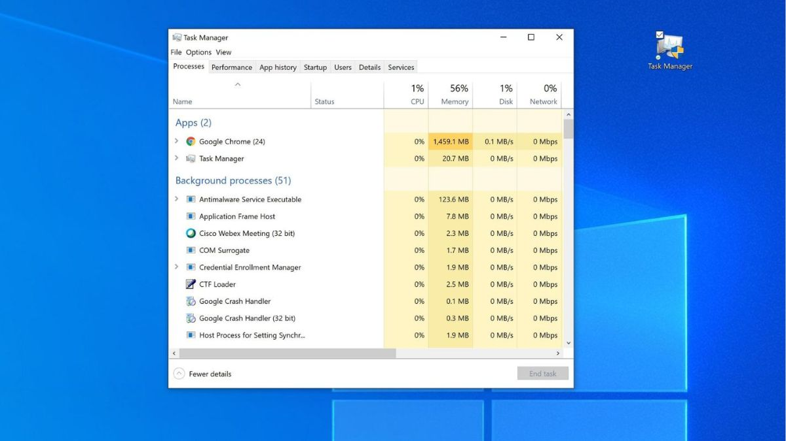
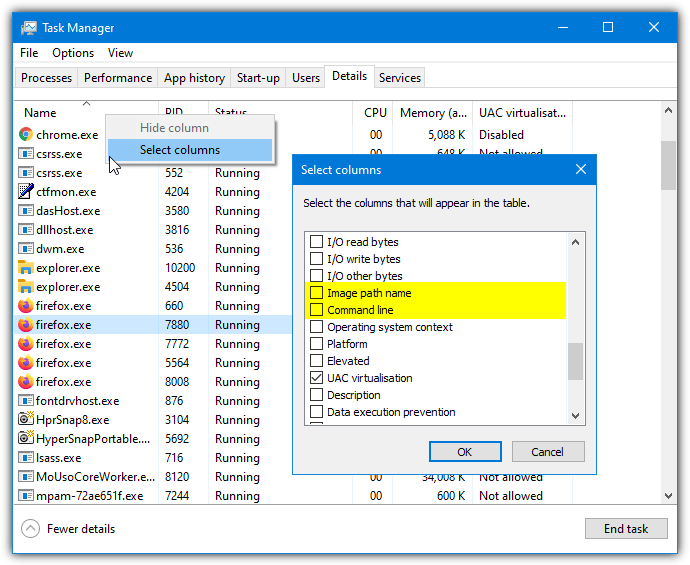
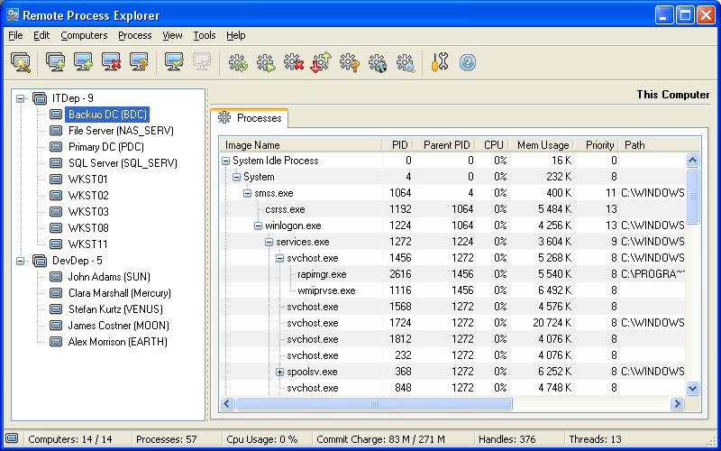
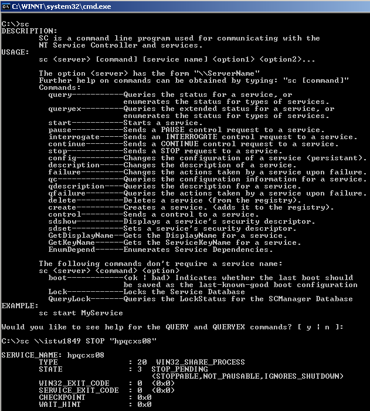
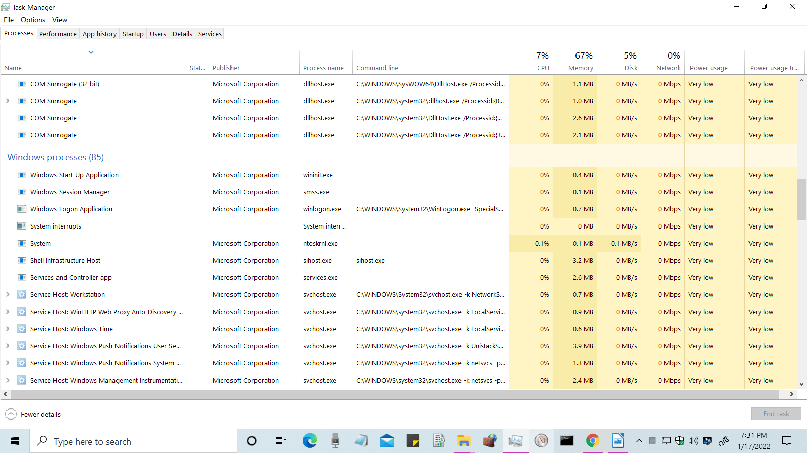

## Enpoint Security Monitoring Checkpoint

---
<!-- class: default -->

# Intro to Endpoint Security

**Endpoint Security Fundamentals**

* Việc hiểu rõ các tiến trình của Hệ điều hành Windows là yếu tố cốt lõi để phân tích log endpoint một cách hiệu quả và phát hiện các hoạt động bất thường.
* Task Manager là một công cụ tốt để tìm hiểu về các tiến trình lõi của Windows, vì nó hiển thị các tiến trình đang hoạt động cùng với mức tiêu thụ CPU và bộ nhớ của chúng.
* Analysts phải sử dụng các bộ phần mềm chuyên dụng để kiểm tra các artifact chạy ngầm của hệ thống và đánh giá chính xác môi trường endpoint, chẳng hạn như bộ công cụ Sysinternals.
* Các ứng dụng đáng chú ý trong bộ công cụ này là TCPView dùng để giám sát mạng và Process Explorer để xem thông tin chi tiết hơn về các tiến trình đang chạy.

---
<!-- class: default -->

# Intro to Endpoint Security

**Endpoint Logging and Monitoring**

* Mặc dù việc giám sát các tiến trình đang chạy rất hữu ích cho việc quan sát thời gian thực, nhưng không thể bỏ qua việc ghi log endpoint liên tục để truy vết và liên tục theo dõi các hoạt động của người dùng.
* Các công cụ ghi và tổng hợp log phổ biến bao gồm:
  * Windows Event Logs
  * Sysmon
  * OSQuery
  * Wazuh

---
<!-- class: default -->

# Intro to Endpoint Security

**Endpoint Log Analysis**

* Thiết lập baseline là việc xác định các điều kiện hoạt động bình thường, theo dự kiến của một môi trường IT. Điều này rất cần thiết để tạo ra một điểm tham chiếu nhằm nhanh chóng phát hiện outlier có khả năng gây nguy hiểm.
* Analysts phải correlate events để tìm ra các mối liên kết có ý nghĩa giữa những artifact nằm rải rác trong log mạng, ứng dụng và endpoint, từ đó xâu chuỗi lại thành một bức tranh toàn cảnh về một sự cố bảo mật.

---
<!-- class: default -->

# Core Windows Processes

**Task Manager**

* Một tiện ích tích hợp sẵn của Windows được sử dụng để giám sát các tiến trình đang chạy, theo dõi mức sử dụng tài nguyên (CPU/Memory) và terminate các ứng dụng.
* Thẻ **Process** phân loại tất cả các hoạt động đang chạy thành Apps, Background processes, và Windows processes.
* Thẻ **Details** hiển thị các cột dữ liệu quan trọng phục vụ cho điều tra số – như PID, Image path name, và Command line – những thông tin cần thiết để phát hiện malicious outliers.
* Hạn chế chính của Task Manager là không hiển thị mối quan hệ tiến trình cha-con, đòi hỏi các nhà phân tích phải sử dụng các công cụ nâng cao như Process Hacker hoặc Process Explorer để có khả năng giám sát sâu hơn.

Mở Task Manager từ powershell: <code>taskmgr</code>

---
<!-- class: default -->

# Core Windows Processes

**Task Manager**

  
  
Thẻ Processes

  
  
Thẻ Details

---
<!-- class: default -->

# Core Windows Processes

#### **System (PID 4)**

* Là một kernel-mode thread chỉ thực thi mã trong system space và cấp phát bộ nhớ động từ các vùng nhớ heap của hệ điều hành.
* Normal Baseline: Luôn được gán PID 4, chạy dưới quyền tài khoản Local System, và tiến trình cha duy nhất của nó là System Idle Process (PID 0).
* Các dấu hiệu bất thường:
  * Sở hữu PID khác 4.
  * Có nhiều instances đang chạy đồng thời.
  * Hoạt động bên ngoài Session 0.
  * Có một tiến trình cha khác với PID 0.

---
<!-- class: default -->

# Core Windows Processes

#### System &gt; smss.exe

- Là user-mode process đầu tiên được khởi chạy bởi kernel, chịu trách nhiệm chính trong việc tạo các phiên hệ thống và phiên cho người dùng mới.
- Nó sinh ra các bản sao tạm thời của chính nó để khởi chạy các hệ thống con cần thiết (như <code>csrss.exe</code>, <code>wininit.exe</code>, và <code>winlogon.exe</code>), và các bản sao này sẽ tự terminate ngay lập tức sau khi quá trình thiết lập hoàn tất.
- Normal Baseline: Chạy dưới quyền tài khoản Local System, có tiến trình cha là System, và được thực thi từ <code>%SystemRoot%\System32\smss.exe</code>.
- Các dấu hiệu bất thường:
  - Có tiến trình cha khác với System (PID 4).
  - Chạy từ bất kỳ image path nào khác ngoài <code>C:\Windows\System32</code>.
  - Quan sát thấy có nhiều hơn một master instance đang chạy cùng lúc.

---
<!-- class: default -->

# Core Windows Processes

  csrss.exe(Client Server Runtime Process)

- Là process chạy ở user mode của Windows subsystem, chịu trách nhiệm quản lý Win32 console window, tạo process/thread và xử lý quá trình tắt hệ thống.
- Normal Baseline: Chạy dưới quyền tài khoản Local System từ `C:\Windows\System32\csrss.exe`, với hai hoặc nhiều phiên bản (instances) thường chạy cùng lúc.
- Được khởi chạy bởi `smss.exe` (tiến trình này tự chấm dứt ngay lập tức), điều này có nghĩa là một tiến trình `csrss.exe` hợp lệ sẽ luôn hiển thị **tiến trình cha không tồn tại**.
- Các dấu hiệu bất thường (Red Flags):
  - Hiển thị một tiến trình cha đang hoạt động.
  - Thực thi từ bất kỳ đường dẫn nào khác ngoài `C:\Windows\System32`.
  - Chạy dưới bất kỳ tài khoản người dùng nào khác ngoài SYSTEM.

---
<!-- class: default -->

# Core Windows Processes

wininit.exe (Windows Initialization Process)

- Chịu trách nhiệm khởi chạy các tiến trình nền quan trọng bên trong Session 0, cụ thể là `services.exe` (Service Control Manager), `lsass.exe` (Local Security Authority), và `lsaiso.exe` (nếu tính năng Credential Guard được bật).
- Normal Baseline: Hoạt động dưới quyền tài khoản Local System từ `C:\Windows\System32\wininit.exe`. Sẽ chỉ có duy nhất một instance hoạt động tại mọi thời điểm.
- Tương tự như `csrss.exe`, nó được tạo ra bởi instance `smss.exe` tạm thời, điều này có nghĩa là một tiến trình `wininit.exe` hợp lệ sẽ luôn hiển thị một tiến trình cha không tồn tại (non-existent parent process).
- Các dấu hiệu bất thường:
  - Hiển thị một tiến trình cha đang hoạt động.
  - Có nhiều hơn một instance chạy cùng lúc.
  - Thực thi từ bất kỳ đường dẫn nào khác ngoài `C:\Windows\System32` hoặc tên tệp sai chính tả.
  - Không chạy dưới quyền tài khoản SYSTEM.

---
<!-- class: default -->

# Core Windows Processes

<h2>wininit.exe > services.exe (Service Control Manager)</h2>

- Chịu trách nhiệm load, tương tác, khởi động và kết thúc các dịch vụ hệ thống và auto-start device drivers. Nó duy trì một cơ sở dữ liệu có thể được truy vấn bằng lệnh `sc.exe`.
- Sau khi người dùng đăng nhập thành công, nó sẽ cập nhật cấu hình **Last known good control set** trong registry, cho phép hệ điều hành khôi phục nếu các driver hoặc dịch vụ mới gây ra lỗi khởi động nghiêm trọng.
- Normal Baseline: Chạy dưới quyền tài khoản Local System từ `C:\Windows\System32\services.exe`. Sẽ chỉ có chính xác một instance đang chạy trên hệ thống.
- Tiến trình cha hợp lệ của nó luôn là `wininit.exe`. Nó đóng vai trò là tiến trình cha cho các tiến trình quan trọng khác như `svchost.exe`, `spoolsv.exe`, `msmpeng.exe`, và `dllhost.exe`.
- Các dấu hiệu bất thường:
  - Có tiến trình cha khác với `wininit.exe`.
  - Có nhiều hơn một instance đang chạy.
  - Thực thi từ một đường dẫn khác ngoài `C:\Windows\System32` hoặc không chạy dưới quyền tài khoản SYSTEM.

---
<!-- class: default -->

# Core Windows Processes

  

  Giao diện dòng lệnh sc.exe (Service Controller) dùng để tương tác và truy vấn cơ sở dữ liệu của services.exe

---
<!-- class: default -->

# Core Windows Processes

<h2>wininit.exe &gt; services.exe &gt; svchost.exe (Service Host)</h2>

- Chịu trách nhiệm host và quản lý các dịch vụ Windows được triển khai dưới dạng DLL.
- Vì có quá nhiều dịch vụ, Windows gộp các dịch vụ tương tự lại với nhau để dùng chung một tiến trình `svchost.exe` duy nhất nhằm giảm thiểu việc tiêu thụ tài nguyên bằng cách sử dụng tham số `-k`.
- Normal Baseline: Thực thi từ `C:\Windows\System32\svchost.exe` với tiến trình cha luôn là `services.exe`. Việc thấy nhiều instance đang chạy đồng thời dưới các tài khoản người dùng khác nhau là điều bình thường.
- Các dấu hiệu bất thường:
  - Hoàn toàn không có tham số `-k` trong command.
  - Có bất kỳ tiến trình cha nào khác `services.exe`.
  - Thực thi từ một đường dẫn khác ngoài `C:\Windows\System32` hoặc sử dụng các lỗi sai chính tả để ẩn mình một cách tinh vi.

---
<!-- class: default -->

# Core Windows Processes

<h2>wininit.exe &gt; lsass.exe (Local Security Authority)</h2>

- Thực thi các system security policies, xử lý quá trình xác thực người dùng, tạo access tokens (SAM, AD, NETLOGON), và ghi dữ liệu vào Windows security log.
- Là mục tiêu hàng đầu của attackers tìm cách trích xuất credentials trực tiếp từ bộ nhớ (ví dụ: sử dụng Mimikatz) hoặc sử dụng các tên gần giống để che giấu các tiến trình độc hại một cách tinh vi.
- Normal Baseline: Hoạt động dưới quyền tài khoản Local System từ `C:\Windows\System32\lsass.exe`. Sẽ chỉ có chính xác một instance đang chạy trên hệ thống và tiến trình cha của nó luôn là `wininit.exe`.
- Các dấu hiệu bất thường:
  - Hiển thị bất kỳ tiến trình cha nào khác ngoài `wininit.exe` hoặc có nhiều instance chạy đồng thời.
  - Thực thi từ một đường dẫn khác ngoài `C:\Windows\System32`, sử dụng các lỗi sai chính tả nhỏ hoặc chạy dưới một tài khoản khác ngoài SYSTEM.

---
<!-- class: default -->

# Core Windows Processes

<h2>winlogon.exe (Windows Logon)</h2>

- Quản lý quá trình đăng nhập của người dùng, xử lý Secure Attention Sequence (SAS) (Ctrl+Alt+Delete) để thu thập credentials một cách an toàn.
- Load profile `NTUSER.DAT` của người dùng vào registry (HKCU), sau đó `userinit.exe` sẽ khởi chạy shell của người dùng (`explorer.exe`). Nó cũng quản lý việc khóa màn hình và chạy trình bảo vệ màn hình.
- Normal Baseline: Chạy dưới quyền tài khoản Local System từ `C:\Windows\System32\winlogon.exe`.
- Được tạo ra bởi một instance `smss.exe` tạm thời, vì vậy một phiên bản hợp lệ sẽ luôn hiển thị một tiến trình cha không tồn tại (non-existent parent process). Bạn sẽ thấy một phiên bản tương ứng cho mỗi phiên người dùng.
- Các dấu hiệu bất thường:
  - Hiển thị một tiến trình cha đang hoạt động.
  - Thực thi từ bên ngoài `C:\Windows\System32` hoặc không chạy dưới quyền tài khoản SYSTEM.
  - Giá trị "Shell" trong registry trỏ đến bất kỳ tệp nào khác ngoài `explorer.exe`.

---
<!-- class: default -->

# Core Windows Processes

<h2>explorer.exe (Windows Explorer)</h2>

- Là shell chính của người dùng, cung cấp giao diện đồ họa để truy cập các tệp, thư mục, Start menu và Taskbar.
- Normal Baseline: Thực thi từ `C:\Windows\explorer.exe`. Bạn thường sẽ thấy một hoặc nhiều instances cho mỗi người dùng đăng nhập tương tác, chạy với quyền tài khoản của người dùng đó.
- Là tiến trình cha cho nhiều ứng dụng được người dùng khởi chạy, nhưng tiến trình cha của chính nó (`userinit.exe`) sẽ thoát ngay lập tức sau khi sinh ra nó. Do đó, một tiến trình `explorer.exe` hợp lệ sẽ luôn hiển thị một tiến trình cha không tồn tại.
- Các dấu hiệu bất thường:
  - Hiển thị một tiến trình cha đang hoạt động.
  - Thực thi từ bất kỳ đường dẫn nào khác ngoài `C:\Windows` (lưu ý rằng nó **không** nằm trong thư mục `System32`).
  - Khởi tạo các kết nối mạng TCP/IP outbound bất thường.

