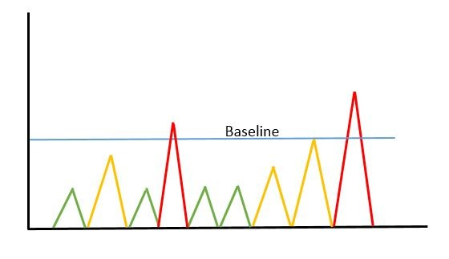

## Enpoint Security Monitoring Checkpoint

---
<!-- class: default -->

# Intro to Endpoint Security

**Endpoint Security Fundamentals**

* Việc hiểu rõ các tiến trình của Hệ điều hành Windows là yếu tố cốt lõi để phân tích log endpoint một cách hiệu quả và phát hiện các hoạt động bất thường.
* Task Manager là một công cụ tốt để tìm hiểu về các tiến trình lõi của Windows, vì nó hiển thị các tiến trình đang hoạt động cùng với mức tiêu thụ CPU và bộ nhớ của chúng.
* Analysts phải sử dụng các bộ phần mềm chuyên dụng để kiểm tra các artifact chạy ngầm của hệ thống và đánh giá chính xác môi trường endpoint, chẳng hạn như bộ công cụ Sysinternals.
* Các ứng dụng đáng chú ý trong bộ công cụ này là TCPView dùng để giám sát mạng và Process Explorer để xem thông tin chi tiết hơn về các tiến trình đang chạy.

---
<!-- class: default -->

# Intro to Endpoint Security

**Endpoint Logging and Monitoring**

* Mặc dù việc giám sát các tiến trình đang chạy rất hữu ích cho việc quan sát thời gian thực, nhưng không thể bỏ qua việc ghi log endpoint liên tục để truy vết và liên tục theo dõi các hoạt động của người dùng.
* Các công cụ ghi và tổng hợp log phổ biến bao gồm:
  * Windows Event Logs
  * Sysmon
  * OSQuery
  * Wazuh

---
<!-- class: default -->

# Intro to Endpoint Security

**Endpoint Log Analysis**

* Thiết lập baseline là việc xác định các điều kiện hoạt động bình thường, theo dự kiến của một môi trường IT. Điều này rất cần thiết để tạo ra một điểm tham chiếu nhằm nhanh chóng phát hiện outlier có khả năng gây nguy hiểm.
* Analysts phải correlate events để tìm ra các mối liên kết có ý nghĩa giữa những artifact nằm rải rác trong log mạng, ứng dụng và endpoint, từ đó xâu chuỗi lại thành một bức tranh toàn cảnh về một sự cố bảo mật.

